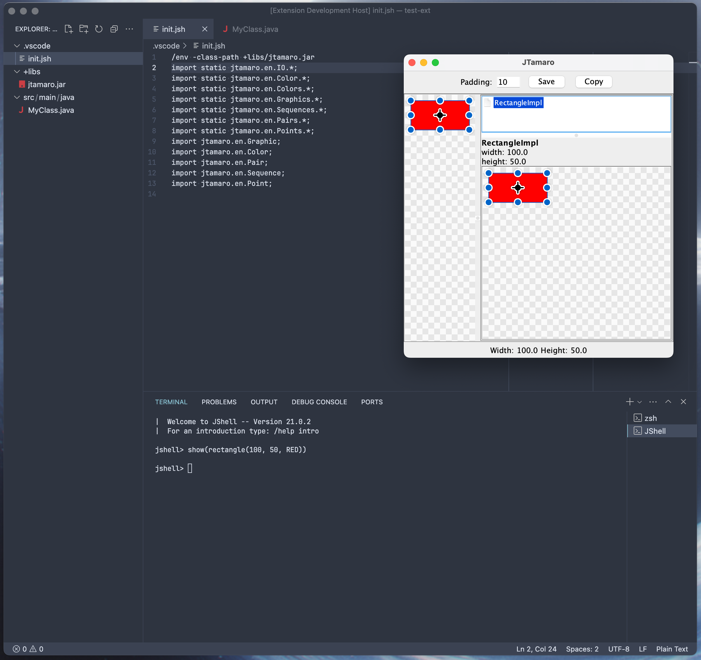

# JShell extension for VSCode

## Features

- Adds "JShell" terminal profile (`CTRL + ALT + J` or `⌘ + ⌥ + J` when editing Java files)
- Automatically sets the classpath to the contents of the `.vscode/class-path.jsh` file (new-line separated entries)
- Automatically loads the `.vscode/init.jsh` file, if found in the current workspace
- JShell configuration in VSCode settings
- [Gradle for Java](https://github.com/microsoft/vscode-gradle) extension integration to `assemble` and open a new JShell instance

## Install

- **Marketplace**
  - [Visual Studio Marketplace](https://marketplace.visualstudio.com/items?itemName=luceresearchlab.vs-jshell)
  - [OpenVSX Registry](https://open-vsx.org/extension/luceresearchlab/vs-jshell)
- **Manually** (from GitHub Actions)
  1. Download and extract the `vsix` file from the GitHub actions [artifacts](https://github.com/LuCEresearchlab/vscode-jshell/actions/workflows/build.yml)
  2. Execute `code --install-extension path/to/vscode-jshell-$VERSION.vsix`
  3. Open a new VSCode instance

## Other

- For build instructions, see [BUILD.md](./BUILD.md)
- For notable changes, see [CHANGELOG.md](./CHANGELOG.md)
- For license, see [LICENSE](./LICENSE)
